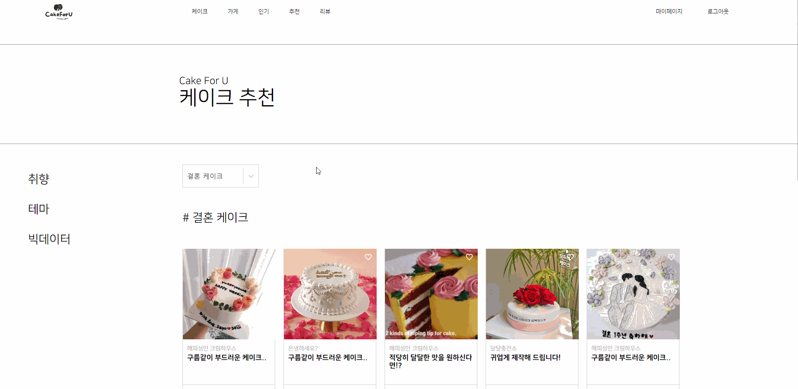

# CakeForU

빅데이터 기반 커스텀 케이크 추천 및 주문 제작 플랫폼

## :video_game: 프로젝트 진행 기간

2022.02.27(월) ~ 2022.04.07(금) (6인, 6주, 9MM)

## 🍰 CakeForU - 배경

소중한 날, 소중한 사람만을 위한 특별한 케이크를 주문하고 싶으신가요? 하지만 커스텀케이크를 처음 주문하는 이에게는 무엇부터 시작해야할지 막막하기도 합니다.

CakeForU는 커스텀케이크 추천을 통해 디자인을 참고할 수 있고, 가게와 매칭하여 규격화된 주문서를 사용해볼 수 있습니다. 또한 DIY를 통해 직접 케이크를 디자인해볼 수도 있습니다. 특별한 날을 더 특별하게, CakeForU가 당신의 고민을 덜어드립니다.

## 🧁 RealCart - 개요

CakeForU는 케이크 가게가 직접 올린 케이크 포트폴리오들을 열람할 수 있습니다. 더불어 연령/성별, 테마, 위시리스트를 기반으로 케이크를 추천받아 디자인에 참고할 수 있습니다.
주문자는 케이크 가게에서 정해진 명세서를 직접 작성하여 전달할 수 있고, 마이페이지에서 주문 현황을 파악할 수 있습니다. 주문이 완료된 케이크는 픽업 후 리뷰를 남길 수 있습니다.
케이크 DIY 페이지에서는 드래그 앤 드롭으로 사용자가 직접 케이크를 디자인할 수 있으며, 이를 export하여 주문에 활용할 수 있습니다.
사용자는 위시리스트에 케이크 포트폴레오를 담을 수 있으며, 이를 기반으로 Collaborative filtering 알고리즘을 통한 케이크 추천을 받을 수 있습니다.

## 🍬 주요 기능

### 랜딩 페이지

> 가장 먼저 접하게 되는 랜딩페이지입니다.

### 메인 페이지

> 구매자가 로그인 후 접하는 페이지입니다.

### 인기 페이지

> 현재 인기있는 가게와 케이크 포트폴리오를 상위 5개씩 보여줍니다.

### 포트폴리오 페이지

> 가게에서 등록한 케이크 포트폴리오들을 인피니티 스크롤로 열람할 수 있습니다.
> 클릭시 모달 창이 생성됩니다.

### DIY 페이지

> 드래그 앤 드롭으로 직접 주문 이전 케이크를 만들어보는 페이지입니다.

### 구매자 전용 페이지

---

### 추천 페이지

> 성별/연령, 테마별로 케이크를 추천받을 수 있습니다.

### 추천 페이지 (위시리스트 기반)

> 본인의 위시리스트를 기반으로 협업필터링 알고리즘을 통해 케이크를 추천받을 수 있습니다.

### 주문 페이지

> 가게에 원하는 커스텀 케이크를 주문할 수 있습니다. Stable Diffusion 모델을 통해 해당 조건에 맞는 케이크 이미지를 추천받을 수 있습니다.

### 마이 페이지

> 개인 정보 수정을 할 수 있고, 내 주문 목록, 위시리스트, 리뷰 목록을 확인할 수 있습니다.

### 내 주문 목록

> 주문 상태를 파악할 수 있고, 픽업이 완료된 케이크에 대해 리뷰를 남길 수 있습니다.

### 내 리뷰 목록

> 내가 쓴 리뷰들을 볼 수 있습니다.

### 판매자 전용 페이지

---

### 판매자 페이지

> 내 가게 정보를 관리할 수 있습니다.

### 주문관리 페이지

> 내 가게로 들어온 주문을 관리하며 상태를 변경할 수 있습니다.

### 포트폴리오 등록 페이지

> 케이크 포트폴리오를 등록할 수 있습니다.

### 주문서 커스텀 페이지

> 내 가게 재료에 맞는 주문 명세서를 만드는 페이지입니다.

## 시스템 구성

- 자세한 설정은 `exec` 폴더 안의 `Porting Manual.md`를 참고 바랍니다.

## ERD

